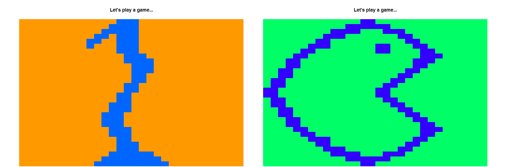
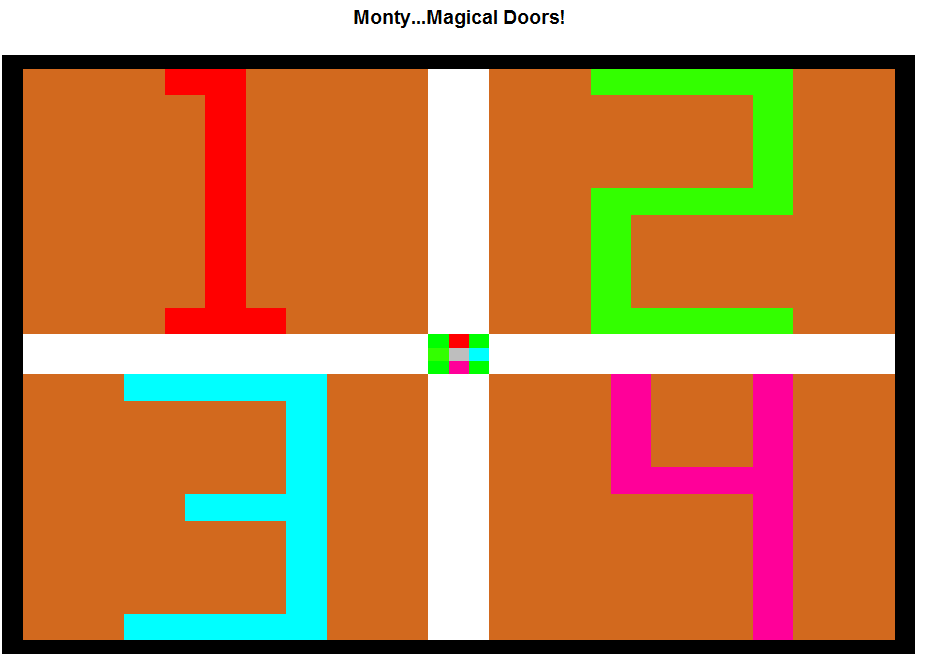

A timed typing game that has a Monty Hall bet to win Monopoly (fictional) money!

SUMMARY: During my stint at a startup called Captricity, every quarter we are given 1 week called Challenge Week where we can build anything we want. Capsino is the 2nd game I built. One of the lead engineers jokingly brought up a hypothetical game called Capsino where Captricity would reward workers with a casino-type game. He mentioned it; I built it! The clock stops and you type as fast and accurately as you can. Upon submitting your answer, the computer checks certain words for accuracy. If you successfully clear the level, then you win the opportunity to play a pseudo-Monty Hall game. You get to pick 1 of 4 doors, and pray to the Probabilistic Gods that you win. Rinse and repeat--endless fun.

HOW TO RUN IT: Just fork and clone the repo and run the entire code. Then, type "play.capsino()" and then you can play the game. Type as fast and accurately as you can; you have a time limit and an accuracy threshold.

Riddle me this: Behind this wall are 4 doors
They can either make you rich or make your poor
There is but 1 prize
but here's a surprise
[1] "The winning door pays out its name"
[1] "But don't get greedy, that's the game"
[1] "After you pick, 2 doors disappear"
[1] "For you, it might bring joy or fear"
[1] "As nobody knows what's behind the door, not even me!"
[1] "So may I ask, what door for thee? 1/2/3/4"

